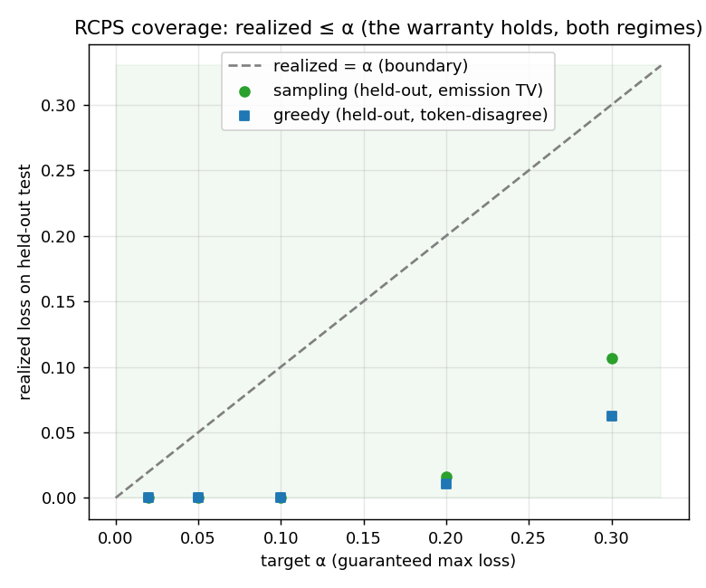
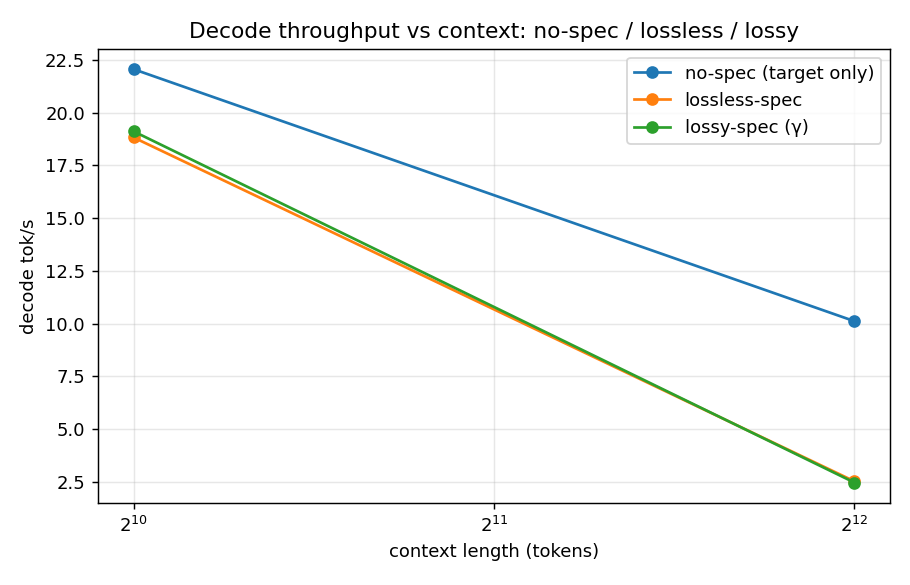
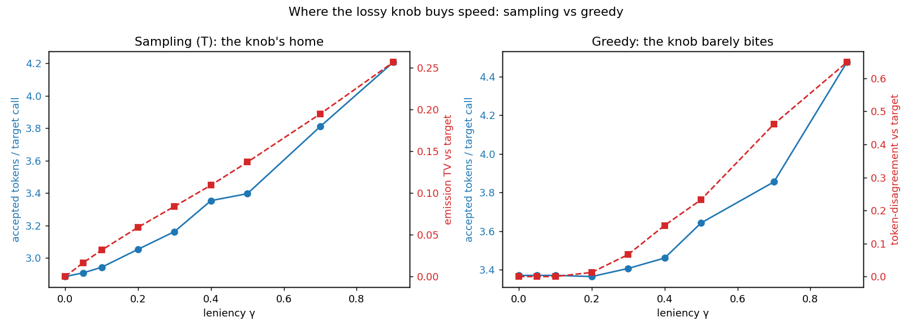
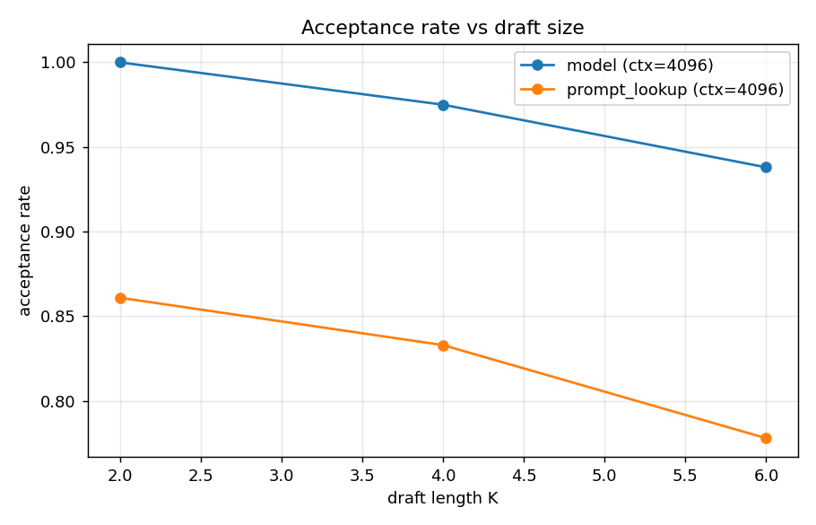
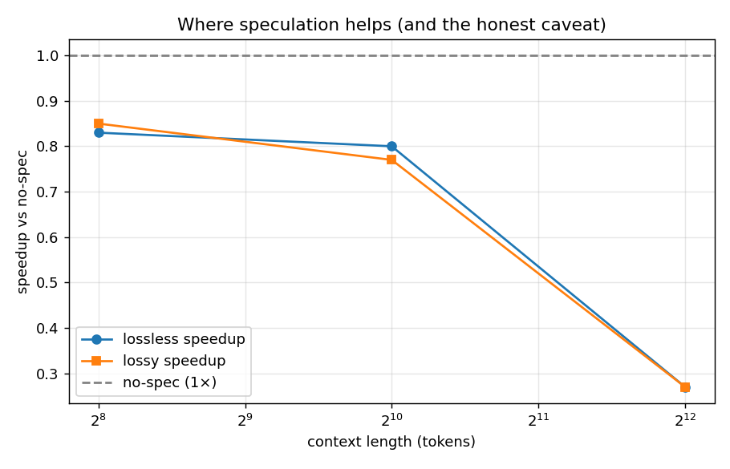

<h1 align="center">Spec Roofline</h1>

<p align="center">
  <b>Speculative decoding for long-context, batch-1 LLM decode — with roofline-style step-cost accounting and a conformally-bounded "lossy" acceptance knob. Every speedup gated against the target's own output distribution.</b>
</p>

<p align="center">
  <a href="#the-knob"></a>
  <a href="spec_roofline/verify.py"></a>
  <a href="#reproduce"></a>
  <a href="#7-correctness-gates-non-negotiable"></a>
  <a href="#7-correctness-gates-non-negotiable"></a>
  <a href="https://github.com/rishi-more-2003/spec-roofline/actions/workflows/tests.yml"></a>
  <a href="RESULTS.md"></a>
</p>

<p align="center">
  <a href="#tldr"><b>TL;DR</b></a> ·
  <a href="#key-results"><b>Key Results</b></a> ·
  <a href="#the-knob"><b>The Knob</b></a> ·
  <a href="#method"><b>Method</b></a> ·
  <a href="#the-honest-caveat"><b>The Honest Caveat</b></a> ·
  <a href="#reproduce"><b>Reproduce</b></a> ·
  <a href="#project-structure"><b>Project Structure</b></a> ·
  <a href="#related-work"><b>Related Work</b></a>
</p>

---

## TL;DR

> A small **draft** model (Qwen2.5-0.5B) proposes K tokens; the **target** (Qwen2.5-1.5B) verifies them in **one** batched forward. The standard rejection-sampling verify is *provably distribution-preserving* — and we gate it: with a fixed seed, lossless-spec reproduces the target's greedy output **token-for-token**, which only holds if KV rollback after each rejection is exact. The step-count lever lands cleanly: **7 target forwards instead of 33** for 32 tokens — **4.7× fewer expensive steps** (*step-count; wall-clock is net-negative at 1.5B:0.5B on 8 GB — analysed, not hidden*). The contribution is the **lossy knob**: one monotone leniency parameter `γ` carrying a **distribution-free RCPS warranty** that realized quality loss stays **≤ α** on held-out data. It earns its billing in its home regime — **sampling**, where there is a distribution to preserve: with the right *distributional* risk (emission TV vs the target), the held-out warranty certifies **γ=0.4 at α=0.3 and buys ~+16% accepted-tokens-per-call** (realized TV 0.107 ≤ 0.3), on a flat frontier (+46% by γ=0.9 at TV 0.26). Under **greedy** the target is a point mass and the same knob is near-inert (+1.1%) — the regime dependence is the finding, and it is exactly what the conformal framing predicts. Third in a trilogy — [decode-roofline](https://github.com/rishi-more-2003/decode-roofline) (weight bytes) → [kv-roofline](https://github.com/rishi-more-2003/kv-roofline) (KV bytes) → **spec-roofline (step count)** — same discipline throughout: *no speedup number ships unless its path proves what it claims, and a lever that doesn't pay is reported as such.*

---

## Overview

Batch-1 decode over a long context is HBM-bandwidth-bound: each token streams the
whole model (and KV cache) from DRAM. The trilogy's through-line is that **the
cheapest token is the one you never run the big model for.** This repo makes the
*expensive unit* a **target forward** and asks a narrow question:

> Can we cut the number of expensive target steps with speculation, prove the
> lossless path matches the target distribution token-for-token, and then trade a
> *measured, bounded* slice of fidelity for more speed — on 8 GB consumer silicon?

Yes — with the quality cost bounded, not hand-waved. Two regimes:

- **lossless** — exact rejection-sampling verify (Leviathan/Chen). Same output
  distribution as the target, just fewer target calls. The speedup floor *and* the
  correctness oracle.
- **lossy** (the contribution) — relax acceptance with one knob `γ` and put a
  **conformal / RCPS bound** on the resulting quality drop. A tunable
  speed↔fidelity dial *with a receipt* — the "compression with a warranty" idea
  from [kv-roofline](https://github.com/rishi-more-2003/kv-roofline), applied to
  **time** instead of **memory**. `γ = 0` reduces exactly to the lossless rule.

The build follows the taskspec phases, each independently testable:

1. **Phase 0** — scaffold, config, load target+draft, no-spec baseline (the measuring stick).
2. **Phase 1** — drafter + engine + **exact verify**. Gate output == target token-for-token.
3. **Phase 2** — lossy relaxed acceptance + **RCPS calibration** of `γ`. Gate the coverage bound.
4. **Phase 3** — ablations, plots, the honest crossover analysis.

---

## Key Results

### Headline numbers

| | no-spec | lossless-spec | lossy-spec (calibrated) |
|---|---:|---:|---:|
| target forwards (32 tok) | **33** | **7** | 7 |
| tokens / target forward | 0.97 | **4.57** | 4.57 → up to +33% (γ-dependent) |
| output vs target (greedy) | — | **token-for-token** | bounded drift ≤ α (RCPS) |
| best tokens/call (K=6, 4k) | — | **6.0** | 6.0 |

**Both §7 gates pass.** Lossless reproduces the target greedy output exactly; the
lossy knob's realized loss stays ≤ α on held-out data for every α budget.

> **Read the 4.7× precisely.** It is **4.7× fewer expensive target forwards**
> (step-count; context-independent) at identical output — **not** a wall-clock
> speedup. On this hardware wall-clock is **net-negative (0.27–0.85×)**; see
> [The Honest Caveat](#the-honest-caveat). The lossy knob's warranty-backed gain is
> **~+16% acc/call at α=0.3 in sampling** (its home regime; held-out) and **+1.1% in
> greedy** (no distribution to preserve) — the [headroom analysis](#where-the-lossy-knob-buys-speed)
> shows why the regime decides.

---

## §7 Correctness gates (non-negotiable)

Mirrors the trilogy's discipline: no throughput number ships unless the producing
path proves what it claims. Both gates are in [`gate.py`](spec_roofline/gate.py) /
[`conformal.py`](spec_roofline/conformal.py) and re-checked by
[`tests/`](tests/test_engine.py).

### Gate 1 — lossless (distribution-preserving)

```
[lossless gate PASS] greedy_match=1.000 (== 1.0)
                     sample_KL=0.07823 vs noise_floor=0.03856 (gap < 0.05)  over 8 prompts
```

- **greedy** — lossless-spec greedy == target greedy, **token-for-token**, all 8 prompts.
  Only holds if KV rollback after each rejection is exact.
- **sample** — token-frequency KL(target ‖ lossless-spec) sits at the finite-sample
  noise floor (KL between two independent target samples) → the rejection-sampling
  verify is distribution-preserving.

### Gate 2 — lossy (RCPS coverage) — `results/coverage.png`

RCPS with an empirical-Bernstein UCB (δ=0.1); calibrate γ on a cal split, verify
**realized loss on a disjoint held-out test split ≤ α**. Run in both regimes — the
**sampling** one is the warranty's home and where the knob is active.

**Sampling (T=1.0), distributional emission-TV risk** (n_cal=40, n_test=40) — **PASS 5/5**:

| target α | calibrated γ | realized held-out TV | valid |
|---:|---:|---:|:--:|
| 0.02 / 0.05 / 0.10 | 0.0 | 0.000 | ✓ |
| 0.20 | 0.05 | 0.016 | ✓ |
| 0.30 | **0.4** (+16% acc/call) | 0.107 | ✓ |

**Greedy, token-disagreement risk** (n_cal=80, n_test=40) — **PASS 5/5**, but the
knob is near-inert (γ≤0.3, +1.1%), so coverage is met largely by falling back to the
exact rule. Both honor the bound with margin (realized ≪ α).



*The warranty, visualized: every point (sampling ●, greedy ■) is the **held-out**
realized loss at the RCPS-calibrated γ for a target α. All sit **below the dashed
realized = α line** — the distribution-free guarantee holds out-of-sample, in both
regimes, with margin (RCPS is conservative by design).*

---

## Results

Full tables in **[RESULTS.md](RESULTS.md)**; plots and CSVs in `results/`.

### Decode throughput — tok/s vs context (the lead) — `results/throughput.png`

| ctx | regime | tok/s | acc/call | target fwds | peak VRAM |
|---:|:--|---:|---:|---:|---:|
| 1024 | no-spec | 22.1 | 0.97 | 33 | 4.8 GB |
| 1024 | lossless | 18.8 | **4.57** | **7** | 4.9 GB |
| 1024 | lossy γ=0.3 | 19.1 | 4.57 | 7 | 4.9 GB |
| 4096 | no-spec | 10.1 | 0.97 | 33 | 7.6 GB |
| 4096 | lossless / lossy | 2.5 | **4.57** | **7** | 7.7 GB |
| 16384 | all | — | — | — | **OOM** (reported, not crashed) |



*Wall-clock tok/s vs context, three regimes. Lossless/lossy track each other (the
knob doesn't change greedy step-count here) and both sit **below** no-spec — the
honest wall-clock caveat. The win is in the `target fwds` column (7 vs 33), not on
this axis; this plot is the lead precisely so the caveat is impossible to miss.*

### Where the lossy knob pays — `results/headroom.png`

The regime decides. Under **sampling (T=1.0)** the knob rides a *flat* frontier and
the held-out RCPS warranty deploys **γ=0.4 at α=0.3 for ~+16% acc/call** (TV ≤ 0.3);
under **greedy** the same knob is near-inert (**+1.1%**) because a point-mass target
leaves no distribution to preserve. Full tables + the "why" in
[The Knob → Where the lossy knob buys speed](#where-the-lossy-knob-buys-speed).



*Acc/call (blue, left axis) and risk (red, right axis) vs leniency γ. **Left —
sampling (T=1.0):** acc/call climbs steeply while the distributional risk (emission
TV) stays low → a flat, exploitable frontier, the knob's home. **Right — greedy:**
acc/call barely moves until risk has already blown up → no usable trade. Same knob,
opposite verdict, set entirely by target entropy.*

### Acceptance rate vs K / drafter — `results/acceptance.png`

| drafter | ctx | K=2 | K=4 | K=6 |
|:--|---:|---:|---:|---:|
| small-model 0.5B | 4096 | 1.00 | 0.98 | 0.94 |
| small-model 0.5B | 1024 | 0.83 | 0.75 | 0.63 |
| prompt-lookup | 4096 | 0.86 | 0.83 | 0.78 |
| prompt-lookup | 1024 | 0.50 | 0.35 | 0.30 |

The 0.5B draft is a strong predictor (84–100% at K≤4); prompt-lookup (zero draft
weights) climbs sharply with context as the n-gram matcher gets more to copy.



*Acceptance rate vs draft length K, per drafter (largest context shown). It falls
with K — later drafts are conditioned on more speculative context — so there is a
sweet spot: more K amortises the target forward over more tokens, but each token is
likelier to be rejected. The 0.5B model sits high (little headroom for the lossy
knob under greedy); prompt-lookup is lower and more context-dependent.*

### Quality — no-spec / lossless / lossy

| regime | passkey | task acc | token agreement vs target |
|:--|---:|---:|---:|
| no-spec | 1.00 | 0.83 | 1.000 |
| lossless | 1.00 | 0.83 | **1.000** |
| lossy γ=0.3 | 1.00 | 0.83 | 1.000 |

wikitext-2 ppl (target == lossless by construction): **7.321**.

---

## The knob

One scalar **leniency** parameter `γ`, a **top-mass / nucleus-gated** accept
([`lossy.py`](spec_roofline/lossy.py)):

> Accept drafted token `d` iff the target probability mass strictly above
> `p_target(d)` is `≤ γ` — i.e. `d` lies in the target's top-`γ` nucleus.

- `γ = 0` → only the target argmax qualifies → **exact greedy verify** (lossless).
- `γ → 1` → accept anything the draft proposes (max speed, max drift).
- Monotone and *smoothly biting* — confident targets still have low-mass runner-ups,
  unlike a raw probability-ratio test (taskspec §4 lists top-p / entropy-gated
  accept as an allowed relaxation).

**The risk the warranty bounds** ([`conformal.py`](spec_roofline/conformal.py)):
the token-disagreement rate vs the *lossless-spec* continuation (which Gate 1
certifies equals the target). It is structurally 0 at `γ=0` and monotone in `γ`.
RCPS picks the **largest** `γ` whose empirical-Bernstein UCB on `E[risk] ≤ α` —
the most aggressive dial that still carries the warranty.

### Where the lossy knob buys speed

The load-bearing question is *where does it beat lossless?* The answer is the
**decode regime**, because that sets target entropy — and a distribution-free
warranty needs a distribution to grip (`results/headroom.png`;
`python -m spec_roofline.cli headroom`).

**Sampling (T=1.0) — the home regime.** Risk is the **distributional emission TV**
`TV(p_γ ‖ p)` (closed-form from target `p` and draft `q`; 0 at γ=0 by the
speculative-sampling identity; low-variance):

| γ | acc/call | Δ vs lossless | TV risk |
|---:|---:|---:|---:|
| 0.0 | 2.89 | — | 0.000 |
| 0.3 | 3.16 | +9.6% | 0.084 |
| 0.5 | 3.40 | **+17.7%** | 0.137 |
| 0.9 | 4.21 | **+46%** | 0.257 |

The frontier is **flat** — a high-entropy target spreads mass over near-synonyms, so
accepting a draft token in that mass is nearly free. On a **held-out** split (40 cal +
40 test, the §7 lossy gate in its home regime — `lossy_coverage_sampling.csv`) the
RCPS warranty deploys **γ=0.4 at α=0.3 → ~+16% acc/call** at realized TV 0.107 ≤ 0.3
(in-sample sweep gives γ=0.5 / +17.7%). *This is the knob earning its billing.*

**Greedy — the honest contrast.** A point-mass target makes every rejection a
non-argmax **far-miss**; leniency can only buy drift, so the warranty deploys only
**+1.1% at α=0.3** (token-disagreement risk).

> **The finding is the regime dependence.** A relaxed-acceptance knob under a
> *distribution-free* warranty is decoration where there is no distribution to
> preserve (greedy) and a real speed↔fidelity lever where there is (sampling). Its
> value tracks **target entropy**, and widens further with a weaker draft (more
> recoverable rejections). That is the contribution, scoped — not oversold.

---

## Method

### The three cores (taskspec §9, implemented in full)

1. **Drafter** ([`drafter.py`](spec_roofline/drafter.py)) — the 0.5B small model
   (autoregressive; returns draft distributions for the sampling verify) **and** a
   zero-weight prompt-lookup / n-gram drafter behind a flag.
2. **Exact verify — the oracle** ([`verify.py`](spec_roofline/verify.py)) — the
   distribution-preserving accept/correct step. Greedy: accept the run matching the
   target argmax, correct the first miss. Sample: accept `d` w.p. `min(1, p(d)/q(d))`,
   resample the reject from `norm((p−q)₊)`, append a bonus token on full accept.
3. **Lossy + RCPS** ([`lossy.py`](spec_roofline/lossy.py) +
   [`conformal.py`](spec_roofline/conformal.py)) — the `γ` knob and the
   distribution-free calibration that bounds its quality loss.

### Engine + KV rollback (the subtle systems part)

Each round ([`engine.py`](spec_roofline/engine.py)) runs **one** target forward over
`[last_committed, d₁…d_K]` (K+1 distributions), accepts the longest valid prefix
plus one correction/bonus token, and **crops both KV caches** back to the committed
length ([`model.sync_cache`](spec_roofline/model.py)), discarding the rejected
drafts' KV. Caches hold `committed[:-1]`; the last committed token is re-fed so the
models produce a distribution for the first drafted slot.
`n_target_forwards == n_rounds`; mean emitted-tokens-per-target-call is the lever.

---

## The honest caveat

`results/crossover.png` — and stated up front because the trilogy is about *where*
a lever pays off, not cheerleading.

| ctx | lossless speedup | lossy speedup |
|---:|---:|---:|
| 256 | 0.83× | 0.85× |
| 1024 | 0.80× | 0.77× |
| 4096 | 0.27× | 0.27× |



*Wall-clock speedup vs no-spec, across context. Both curves stay **below the 1×
dashed line** and fall as context grows — speculation costs wall-clock here, worsening
with memory pressure. This is the caveat plot, shown deliberately: the step-count win
(4.7×, a different axis) is real; the wall-clock loss is too, and naming why is the
point.*

The roofline *step-count* win (4.7× fewer target forwards) **does not convert to
wall-clock** in this regime. Two honest reasons:

- **Target:draft ratio is too small.** A 1.5B target vs a 0.5B draft is only ~3× —
  one target forward does not dominate the 4 draft forwards + per-token
  Python/launch overhead of this *reference* decode loop.
- **8 GB can't hold two big KV caches.** At ctx ≥ 4k the co-resident target+draft
  caches hit memory pressure (7.7/8 GB → allocator thrash); 16k OOMs.

This is consistent with the taskspec's explicit non-goals (no production server, not
beating vLLM in absolute tok/s) and *is itself the trilogy's recurring lesson: the
8 GB memory wall decides where a lever pays off.* The step-count result is the
implementation-independent contribution; the wall-clock payoff needs a larger
target and a fused backend — its serving home is
[conformal-serve](https://github.com/rishi-more-2003/conformal-serve) (taskspec §10).

---

## Reproduce

### Setup

```bash
pip install -e .          # torch (CUDA 12.x), transformers, datasets, matplotlib
```

Target (`Qwen2.5-1.5B-Instruct`) + draft (`Qwen2.5-0.5B-Instruct`) co-reside on an
8 GB RTX 4070 Laptop. Run benchmarks **foreground** (background GPU jobs die on
laptop sleep).

### One command per deliverable

```bash
python -m spec_roofline.cli gate         # §7 lossless + lossy gates (both must pass)
python -m spec_roofline.cli bench        # tok/s vs context + acceptance rates
python -m spec_roofline.cli eval         # passkey + task accuracy + wikitext ppl
python -m spec_roofline.cli calibrate    # RCPS coverage curve (γ per α) + plots
python -m spec_roofline.cli ablate       # K / γ / crossover sweeps + plots
python scripts/run_benches.py            # all benches in one model load -> results/SUMMARY.txt
python -m spec_roofline.cli generate --prompt "Explain why the sky is blue." --gamma 0.3
```

### Tests

```bash
pytest tests/ -q -rs     # verify + RCPS invariants (CPU); engine/rollback auto-skips without CUDA
```

[](https://github.com/rishi-more-2003/spec-roofline/actions/workflows/tests.yml)
CI ([`.github/workflows/tests.yml`](.github/workflows/tests.yml)) runs the pure
tensor tests on Python 3.11/3.12 with CPU-only torch — `test_verify.py` (exact
verify + `γ=0` reduction to the oracle) and `test_conformal.py` (empirical-Bernstein
/ RCPS invariants). The CUDA engine + KV-rollback tests collect and self-skip on
the GPU-less runner.

---

## Project structure

```
spec_roofline/
  config.py        # pinned target/draft, K, the single γ leniency knob, contexts, RCPS α/δ
  model.py         # load target+draft, batched verify forward, sync_cache (KV rollback)
  drafter.py       # Drafter: small-model + prompt-lookup propose()         [§9.1]
  verify.py        # exact rejection-sampling verify — the oracle (greedy+sample) [§9.2]
  lossy.py         # relaxed acceptance: γ top-mass knob; γ=0 ≡ exact        [§9.3]
  conformal.py     # RCPS / empirical-Bernstein calibration of γ to risk ≤ α [§9.3]
  engine.py        # SpeculativeDecoder: draft→verify→accept loop + KV rollback
  gate.py          # §7 lossless gate (token-for-token + KL noise floor)
  data.py          # task suite, gate prompts, passkey, wikitext slice
  bench/           # throughput / acceptance / quality / ablations / headroom / plots
  cli.py           # generate / bench / eval / gate / calibrate / ablate / headroom / all
tests/             # verify & RCPS invariants (CPU) + engine rollback (GPU)
scripts/run_benches.py
```

---

## Related work

- **Speculative decoding** — Leviathan et al., *Fast Inference from Transformers via
  Speculative Decoding* (2023); Chen et al., *Accelerating LLM Decoding with
  Speculative Sampling* (2023). The exact verify here is their distribution-preserving
  accept/correct rule.
- **Prompt-lookup decoding** — Saxena (2023): n-gram drafting with zero draft weights.
- **Risk-controlling prediction sets (RCPS)** — Bates et al. (2021); conformal risk
  control. The leniency knob is calibrated as a risk-controlling decision with an
  empirical-Bernstein UCB (Maurer & Pontil, 2009).
- **The trilogy** — [decode-roofline](https://github.com/rishi-more-2003/decode-roofline)
  (weight bytes), [kv-roofline](https://github.com/rishi-more-2003/kv-roofline)
  (KV bytes), [conformal-serve](https://github.com/rishi-more-2003/conformal-serve)
  (the serving home for the α budget).

**Prior-art note.** The exact verify is applied, not novel; the framing — a single
monotone speculative-acceptance knob carrying a *distribution-free* quality warranty,
reported as a coverage curve — is the contribution. Lead with the measured knob.

---

## Engineering rules

1. **No speedup ships ungated.** Lossless = token-for-token vs target; lossy =
   realized loss ≤ α on held-out. CI fails the bench if a gate fails.
2. **`γ = 0` must reduce to the exact rule** — asserted in `tests/test_verify.py`.
3. **OOM is a data point, not a crash** — reported in the throughput table.
4. **Honest accounting** — the step-count win and the wall-clock caveat are both
   reported, with the cause named.

---

## Citation

```bibtex
@software{spec_roofline,
  title  = {spec-roofline: speculative decoding with a conformally-bounded
            relaxed-acceptance knob},
  author = {More, Rishi},
  year   = {2026},
  url    = {https://github.com/rishi-more-2003/spec-roofline}
}
```
